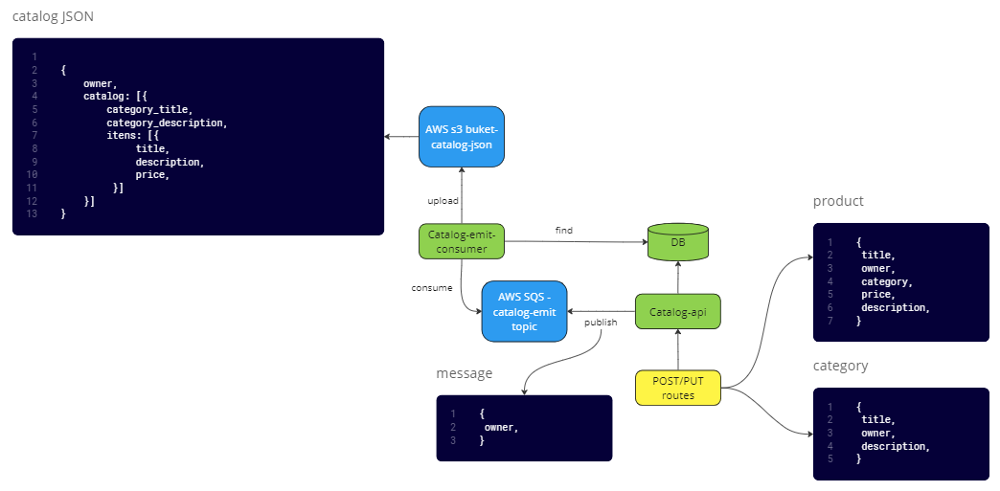

## :fried_shrimp: Restaurant Marketplace

     
  
    
    
    

## 🏗️ Diagrama da Estrutura da API

 

## :computer:	Descrição das ferramentas
  <table align="center">
  	<td>Linguagem</td>
  	<td>Java</td>
  </tr>
  <tr>
  	<td>Framework</td>
  	<td>Spring Boot</td>
  </tr>
  <tr>
  	<td>Build Tool</td>
  	<td>Maven</td>
  </tr>
  <tr>
  	<td>Banco de Dados</td>
  	<td>MongoDB</td>
  </tr>
  <tr>
  	<td>Armazenamento de JSON</td>
  	<td>AWS S3</td>
  </tr>
  <tr>
  	<td>Serviço de mensageria</td>
  	<td>AWS SQS</td>
  </tr>
  </table>

  

 
